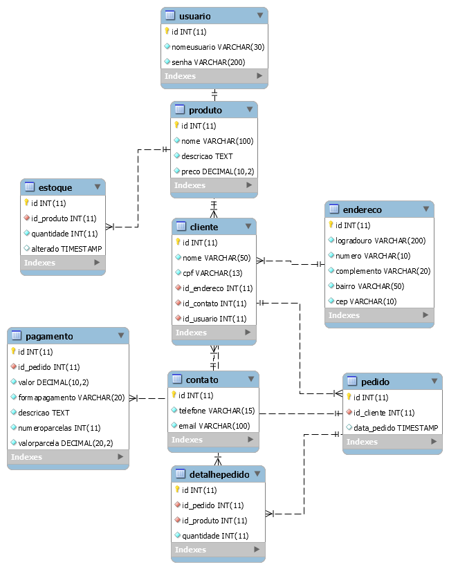

# Loja

O projeto loja é um __estudo__ de como construir, consumir e
Aplicar uma API em [php](https://www.php.net/), com o uso de [IONIC](https://ionicframework.com/). Onde usamos o php
para criar a API com o padrao de desenvolvimento em camadas
seguindo o paradigma da programação orientada a objeto e
gerando uma estrutura para consumo em JSON, ou seja, uma API
REST.

Para o banco de dados usamos o SGDB [MySQL](https://www.mysql.com/) com 9 tabelas. Sendo
estas: Usuario, Contato, Endereco, Cliente, Produto, Estoque,
Pedido, DetalhePedido, Pagamento.

Para o consumo da API foi desenvolvido um App(aplicativo) em
IONIC.

## tecnologias aplicadas ao projeto
[![Node.js Version][node-Version-image]][node-version-url]
[![NPM Version][NPM-image]][npm-url]
[![MySql Version][mysql-image]][mysql-url]
[![PHP Version][php-image]][php-url]

### instalação do NodeJs
Como um ambiente de execução JavaScript assíncrono orientado a eventos, o Node.js é projetado para desenvolvimento de aplicações escaláveis de rede. No exemplo a seguir, diversas conexões podem ser controladas ao mesmo tempo. Em cada conexão a função de callback é chamada. Mas, se não houver trabalho a ser realizado, o Node.js ficará inativo.

#### instalação no windows
[Download do NODE JS](https://nodejs.org/pt-br/download/)

#### instalação no Linux Ubuntu
```bash
sudo apt install nodejs
```
### Instalação do IONIC
O Ionic Framework é um kit de ferramentas de interface do usuário de código aberto para a criação de aplicativos móveis e de desktop de alto desempenho e desempenho, usando tecnologias da web (HTML, CSS e JavaScript).

O Ionic Framework concentra-se na experiência do usuário front-end ou na interação da interface do usuário de um aplicativo (controles, interações, gestos, animações). É fácil de aprender e integra-se perfeitamente a outras bibliotecas ou estruturas, como Angular, ou pode ser usado de forma independente sem uma estrutura de front-end usando um script simples.

#### Comando para instalar
```bash
npm install -g ionic
```


### Banco de dados MySQL
Abaixo é apresentado o diagrama de banco de dados desenvolvido
para este projeto.

